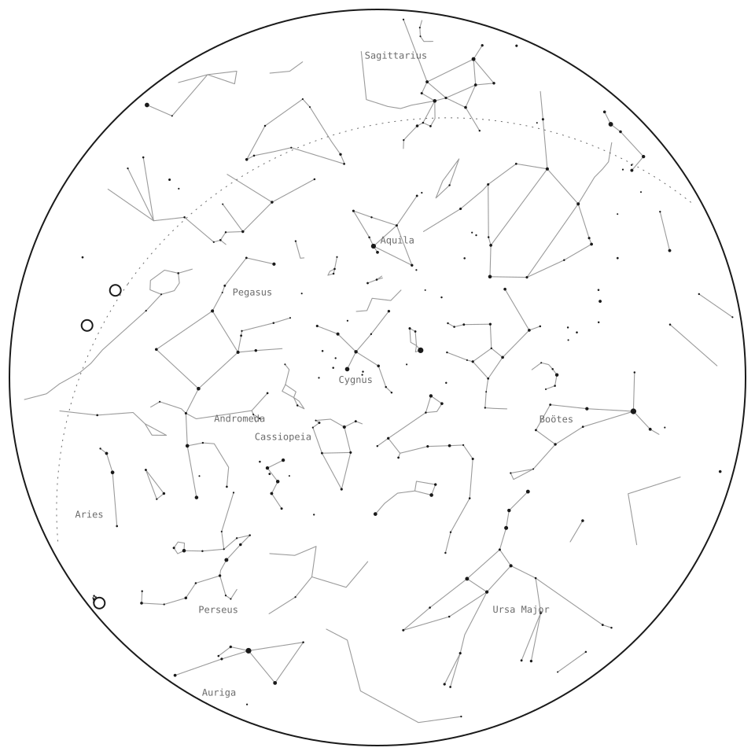

# astralmanach

**The sky of an instant, as data.** Give it a date, an hour and a place: it tells you what the sky held — the Moon and
its phase, the planets you could see and where, the eclipses, oppositions and meteor showers of the day, the passes of the
International Space Station, the fireballs that hit the atmosphere — and hands you a star map ready to draw, with the
constellation figures and their names.

> **Created for [Un art voulu voyant](https://www.uavv.fr), the art project of [Florian Rosinski](https://florianrosinski.fr).**
> It computes the sky of *Observations*, the project's printable sheet of the sky; it was then published on its own, under the MIT licence.

<p align="center">
  <picture>
    <source media="(prefers-color-scheme: dark)" srcset="docs/carte-nuit.svg">
    
  </picture>
  <br>
  <sub>Paris, 30 September 2026, 19:00 UTC — every point and line comes from <code>skyMap()</code>; the drawing is 60 lines of SVG: <a href="examples/carte-svg.mjs">examples/carte-svg.mjs</a></sub>
</p>

[](https://www.npmjs.com/package/astralmanach)
[](https://github.com/Ismaouste/astralmanach/actions/workflows/ci.yml)
[](https://www.npmjs.com/package/astralmanach)
[](package.json)
[](LICENSE)

It is the engine of the Astralmanach tools (a birth chart, a day's sky, a "celestial certificate" of a date), released on
its own. ESM, typed, no build step needed on your side.

```sh
npm install astralmanach
```

## See it in use

- **[astralmanach.eu](https://astralmanach.eu)** — three tools written with the library: a birth chart (*Thème*), a day's sky and archives (*Ciel*), and a "celestial certificate" that puts a date and a place into sentences (*Certificat*). Each source is credited with its licence on the [Sources](https://astralmanach.vercel.app/sources) page.
- **[uavv.fr/observations](https://www.uavv.fr/observations)** — where it was born: *Observations*, a tool of the art project [Un art voulu voyant](https://www.uavv.fr) by [Florian Rosinski](https://florianrosinski.fr), composes a printable A4 sheet of the sky of a date, an hour and a place. The star map, the Moon and the planets on that sheet come from this library.

## Try it without installing

The site serves a read-only HTTP API on the same engine: no account, no key, CORS open. [Documentation](https://astralmanach.eu/api-publique) ·
[OpenAPI 3.1](docs/api/openapi.json) · [Swagger UI](https://petstore.swagger.io/?url=https%3A%2F%2Fastralmanach.eu%2Fapi%2Fopenapi.json) ·
[Postman collection](docs/api/astralmanach.postman_collection.json) · [which keys and sign-ups you need to run it yourself](docs/api/README.md#keys-and-sign-ups--what-you-need-to-run-the-library-yourself).

```sh
curl "https://astralmanach.eu/api/run?query=jpl.horizons&date=2026-09-30&time=21:00&lat=48.8566&lon=2.3522&place=Paris&ptz=Europe%2FParis"
```

## Where it comes from

astralmanach started inside that project: the sheet needed the Moon, the planets, the stars that were up, the eclipses and the ISS passes, in shapes ready to draw. That computation became an engine of its own — civil time and IANA zones, sky events, the celestial vault, plain-language summaries — released here under the MIT licence so the tools above are just uses of the same package.

## What it does that the others don't

There are excellent astronomy libraries in JavaScript. astralmanach does not replace them — it **builds on them** and
answers the question they leave to you: *what did the sky look like, here, at that moment, in words and in shapes?*

| | d3-celestial | astronomy-engine | satellite.js | **astralmanach** |
|---|---|---|---|---|
| What it is | An interactive star-map **renderer** (D3, in the browser) | Low-level **ephemerides** (positions, rise/set, searches) | The **SGP4** orbit propagator | A **"sky of an instant" layer**: data you can show, print or say |
| Civil date + hour + IANA time zone in, the instant out | — | UTC only | UTC only | ✓ (`makeContext`, DST-safe) |
| Star map | ✓ drawn for you, tied to D3 and the DOM | — | — | ✓ **as plain data**: projected stars, constellation lines and labels, planets, horizon — draw it in SVG, canvas, PDF, on the server |
| The day's events (eclipses seen from a place, oppositions, conjunctions, greatest elongations, transits, supermoons, equinoxes, meteor showers) | — | the search primitives | — | ✓ found and described (`skyEvents`) |
| Visible ISS passes from a place | — | — | the propagator | ✓ TLE fetched, passes computed, visibility judged (`issPasses`) |
| Fireballs (NASA/JPL CNEOS) | — | — | — | ✓ fetched and normalised (`fireballs`) |
| A one-line summary of a day's sky | — | — | — | ✓ Moon, Sun rise/set, naked-eye planets (`skyRecap`) |
| Network access with an injected key, cache and User-Agent; keys redacted everywhere; never throws | — | no network | no network | ✓ (`runQuery`, `fetchProvider`) |

Under the hood: positions come from [astronomy-engine](https://github.com/cosinekitty/astronomy) (Don Cross, MIT), orbits
from [satellite.js](https://github.com/shashwatak/satellite-js) (MIT), and the stars, constellation figures and names from
[d3-celestial](https://github.com/ofrohn/d3-celestial) (Olaf Frohn, BSD-3-Clause) — credited below.

## Quick start

### A day's sky, in one sentence

```ts
import { skyRecap } from "astralmanach";

const r = skyRecap({ date: "2026-09-30", time: "21:00", place: { name: "Paris", lat: 48.8566, lon: 2.3522, tz: "Europe/Paris" } });
console.log(r.headline); // the Moon, the Sun, what you could see with the naked eye
```

### A star map, as data

```ts
import { skyAt, skyMap } from "astralmanach/voute";

// The Sun, the Moon and the planets as seen from Paris that evening (altitude, azimuth, magnitude)…
const sky = skyAt(new Date("2026-09-30T19:00:00Z"), { name: "Paris", lat: 48.8566, lon: 2.3522 });
// …and the stars brighter than magnitude 4, the constellation figures and their names, projected into a unit disc
// (stereographic or orthographic): draw them in SVG, on a canvas, in a PDF.
const map = skyMap(sky, { maxMag: 4, projection: "stereo" });
```

### The day's events, the ISS, the fireballs

```ts
import { makeContext, runQuery, skyEvents, issPasses, fireballs } from "astralmanach";

const ctx = makeContext({ date: "2013-02-15", tz: "Asia/Yekaterinburg", place: { name: "Chelyabinsk", lat: 55.16, lon: 61.4 } });
const opts = { key: process.env.NASA_API_KEY ?? "DEMO_KEY", userAgent: "my-site/1.0 (contact@example.org)" };

for (const q of [skyEvents, issPasses, fireballs]) {
  const r = await runQuery(q, ctx, opts); // never throws: r.status is "ok" | "empty" | "error" | "timeout" | "out-of-coverage"
  console.log(q.id, r.status, r.cards.map((c) => c.title));
}
```

Results are **cards** (`event`, `image`, `table`, `text`…): small typed records with a title, facts, links and a time,
ready to render. `skyEvents` needs no network; `issPasses` reads CelesTrak's current elements and refuses dates more than
six days away from them (an old orbit would be wrong); `fireballs` reads NASA/JPL's CNEOS API.

## Modules

| Import | What's inside |
|---|---|
| `astralmanach` | The most used functions and types, re-exported |
| `astralmanach/time` | Civil dates, IANA time zones, the instant of a local date and hour (`makeContext`, `zonedToUtc`, `formatLocal`) |
| `astralmanach/voute` | The celestial vault: `skyAt` (Sun, Moon, planets, altitude and azimuth), `skyMap`, `projectAltAz`, `moonPhaseName`, `equationOfTime` |
| `astralmanach/sky-recap` | `skyRecap`: a day's sky in a sentence |
| `astralmanach/queries/astro-evenements` | `skyEvents`, `SHOWERS` (the IMO meteor-shower table) |
| `astralmanach/queries/celestrak-iss` | `issPasses` |
| `astralmanach/queries/jpl-fireball` | `fireballs` |
| `astralmanach/run`, `astralmanach/fetcher` | `runQuery`, `fetchProvider`: coverage, bounded concurrency, one retry on 429/503, key redaction, an optional cache you provide |
| `astralmanach/cards`, `astralmanach/queries/types` | The card and query types, to write your own sources |
| `astralmanach/data/celestial/*.json` | The raw star, line and name catalogues |

## Design

- **No secrets, no disk.** The library never reads `.env`, `process.env` or files. Your key, your User-Agent and your cache
  (`{ read(url), write(entry) }`) are passed in. Keys are redacted from every URL and every raw response it returns.
- **Never throws.** An unknown response shape gives `[]`; a failing provider gives a result with `status: "error"` and a
  message. Your page always renders.
- **Pure where it can be.** Everything that can be computed is computed locally and synchronously (`skyEvents`, `skyAt`,
  `skyMap`, `skyRecap`); only the ISS and the fireballs go to the network.
- **Civil time done right.** Dates are local to the place, through IANA zones, including daylight saving time; without an
  hour, the instant is local noon.
- **Geocentric positions** (the Moon to the arcminute against JPL Horizons); topocentric altitude and azimuth for what is
  visible from a place.
- **Labels are in French** today (card titles, facts, summaries). The data (numbers, instants, positions) is language-free;
  translations are welcome.

## Data and credits

- Stars, constellation lines and names: **d3-celestial**, © 2015 Olaf Frohn, BSD-3-Clause —
  [`data/celestial/LICENSE-d3-celestial.txt`](data/celestial/LICENSE-d3-celestial.txt).
- Meteor showers: the International Meteor Organization's working list, to the day.
- ISS orbital elements: [CelesTrak](https://celestrak.org/) (please respect its usage guidelines: cache, don't hammer).
- Fireballs: NASA/JPL [CNEOS](https://cneos.jpl.nasa.gov/fireballs/) API.
- Ephemerides: astronomy-engine (MIT); orbits: satellite.js (MIT).

## Development

```sh
npm install
npm run check   # typecheck, lint, tests, build
npm run smoke   # imports the built package the way a user would
node examples/carte-svg.mjs   # redraws the star map above (after npm run build)
```

Releases: bump the version and the [changelog](CHANGELOG.md), tag `vX.Y.Z`, push the tag — CI publishes to npm with
provenance. See [CONTRIBUTING.md](CONTRIBUTING.md).

## En français

astralmanach donne le ciel d'un instant : une date, une heure, un lieu, et il dit ce que le ciel portait — la Lune et sa
phase, les planètes visibles et où les chercher, les éclipses, oppositions et pluies d'étoiles du jour, les passages de la
Station spatiale, les bolides entrés dans l'atmosphère — avec une carte du ciel prête à dessiner, ses constellations et
leurs noms. Il s'appuie sur astronomy-engine, satellite.js et les catalogues de d3-celestial ; il ne lit ni fichier ni
secret, et ne lève jamais d'exception. Les libellés sont en français.

## License

[MIT](LICENSE) © 2026 Ismaël Rodmacq. The bundled catalogues keep their own licence (BSD-3-Clause, see above).
